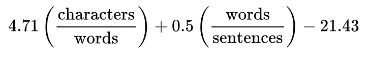

# Exercise 03: Calculating Values
No NEA assignment is complete without asking you to work something out mathematically and store the value alongside the data you've collected. At a very simple level this could be calculating the cost of an order, working out discount or something altogether more exciting like working out a reading age on a document.

It doesn't matter what they ask you to do, the key part is to break down the question into its basic parts and make sure you've got all the data entered as you've been asked *before* you start building your calculation programs.

## Simple Cost Calculator
A really straightforward question might read something like this:

```
A shop sells products to customers, each sale needs to be recorded seperately, and requires the till operator to enter the name of the item, price and quantity. The total costs of the transaction should then be presented on screen.
```

Which sounds simple enough, but how would we build something like this? The first thing to do is to always start with the data that would need to be manually entered into the system, from the question we can see that we need to have the item name, price and quantity for each sale. Let's give that a go.

```python
itemName = input("Item Name: ")
price = float(input("Price: ")
quantity = int(input("Quantity: ")
```

You'll notice that at the moment (and for this exercise) I'm avoiding using **validation**, this is just so the code I'm showing you here is reasonably straightforward. You should always go back and add validation where you can on manual data entry.

The code is reasonably simple, we've got three variables now with data. Interestingly `price` has been cast as a float, this is because anything that is currency would need two decimal places and `float` is the only data type that allows for that. Quantity, on the other hand, has been set as an `int` because you can't really order a fraction of an item.

With that done we need to start with the first round of maths, how do we go about working out the total if we, say, bought two items that were 2.99 each?

```python
itemName = input("Item Name: ")
price = float(input("Price: ")
quantity = int(input("Quantity: ")

totalCost = price * quantity
print("Total:", totalCost)
```

The first line here just does the simple multiplication to calculate the total `price*quantity` is all we need to work out the final cost, we're going to store it in the variable `totalCost` and then simply print it out on the next line.

At this point a lot of people would think they were complete and leave the question here, however the NEA questions are written in a way to encourage you to think about and *decompose* the problem. One of the first things you might be thinking is - hold on, what happens if they want to buy more than one thing? - and you'd be right to wonder that!

A good implementation of the question would take that into account, so we now need to extend the program so that it loops and adds to a running total that represents the cost of all items added to the order.

```python
totalCost = 0

while(True):
	itemName = input("Item Name: ")
	price = float(input("Price: ")
	quantity = int(input("Quantity: ")

	totalCost += price * quantity
	print("Total:", totalCost)
```

Not much has changed: we've placed the code from before inside a `while(True):` loop, just to make sure it repeats, and this has done just that - the only problem is the `totalCost`. Now that we are adding to it each time, rather than calculating it from scratch, we have to **instantiate** the variable. This is a fancy way of saying that we need to start it at zero before the loop starts. With that done we've also changed the line `totalCost = price * quantity` to become `totalCost += price * quantity` , replacing the `=` with `+=`, well why?

The `+=` as an operator means *add to*, so instead of creating a new variable each time it just adds the right hand side to whatever currently exists in that variable. This is the key to creating a running total, adding the result to it each time.

### Discount Calculation

Sometimes in this kind of question you'll find a line like this

```
When the total for that item is calculated, if the customer has bought more than 10 then they get a 20% discount on the subtotal of that item.
```

This can be a bit of head scratcher for most people. What they've told us is that at each iteration of the `while` loop we need to check to see *if* the user has added more than 10 items and if so only add the discounted amount to the total.

Well, implementation of this isn't too bad - but requires a bit of thinking.

```python
totalCost = 0

while(True):
	itemName = input("Item Name: ")
	price = float(input("Price: ")
	quantity = int(input("Quantity: ")

	thisCost = price * quantity
	if(quantity>10):
		thisCost *= 0.8
	totalCost += thisCost

	print("Subtotal:", round(thisCost,2))
	print("Total:", round(totalCost,2))
```

Firstly, rather than just adding to `totalCost` each time, now we're calculating a subtotal with the `thisCost` variable, this allows us to do some maths to this value before we add it.

We've followed up with a really simple `if` statement that activates only if the quantity was greater-than 10, if so then it multiplies `thisCost` by 0.8 - why 0.8? It's simple maths, if we're dealing in percentages then 20% is 0.2 and 100% is 1.0. Therefore is we need to remove 20% it becomes 1.0 - 0.2 giving us 0.8. This makes the maths much faster to build rather than faffing about with working out percentages.

The line `totalCost += thisCost` then adds this changed cost to the `totalCost`, but there is one issue with this: in working out 80% of something we may have accidentally created a total that has more than two decimal places! Nightmare! Luckily this is easy to fix with the built in `round` function, which takes the name of a variable and a number of decimal places and does rounding for us - so `round(thisCost,2)` just gives us `thisCost` to 2 decimal places, just like real money would!


## Lookup Calculator
A different kind of question is often used that asks you to work out the cost based on two inputs and a table, take a look at the example question below.

```
A popular online IDE sells t-shirts on their merch store. The prices for the different t-shirts are given in the table below:
```
|       |   S   |   M   |   L   |
|-------|-------|-------|-------|
| Blue  | 9.99  | 10.99 | 11.99 |
| Red   | 10.99 | 12.49 | 13.99 |
| Black | 12.99 | 14.99 | 16.99 |
```
Write an algorithm that takes the size and colour and returns the correct price.
```

Again, this is one of those questions that causes most people to stop in their tracks. Most try to implement the table as 2D data structure (*because they vaguely recall it from their lessons*) and then have a little cry in the corner. Well Ladies, Gentlemen and Non-Binary People, I'm here to tell you that a 2D data structure is very cool but also extremely difficult to pull off in timed exam conditions. It's actually quite easy to build an algorithm that does this and a lot of it can be **copy and pasted** which is always a win in my book.

The trick is to break the problem down further, let's start with the first row:


|       |   S   |   M   |   L   |
|-------|-------|-------|-------|
| Blue  | 9.99  | 10.99 | 11.99 |


So, now the problem becomes a little more straightforward if we're just dealing with the Blue t-shirts. Let's start our program off in the same way we always do, let's get the data inputs done.

```python
price = 0.0
size = input("Size: ").lower()
colour = input("Colour: ").lower(()
```

Notice that we've **instantiated** our price, but haven't asked for it. This is to ensure that if we can't find the correct colour or size then no charge is being set for a product that doesn't exist. We're also being a bit of a smarty pants and using the wonderful `.lower()` function in-line with the input, this means that we completely lose the original text entered by the user but what is stored is the lowercase version of itself.

With that done then we need to deal with the colour blue.

```python
price = 0.0
size = input("Size: ").lower()
colour = input("Colour: ").lower(()
if(colour=="blue"):
```

A nice simple `if` statement there that just deals with the colour blue; notice that `blue` is in lowercase as we changed the user's input to lowercase. If we were to type in `Blue` then it would never activate as there's no way for the system to store anything other than lowercase from the user.

One if statement down, now let's take a look at the first size in our table - it's a small, so let's just add a nested `if`.

```python
price = 0.0
size = input("Size: ").lower()
colour = input("Colour: ").lower(()
if(colour=="blue"):
	if(size=="s"):
		price = 9.99
```

It's as easy as that! The nested `if` just means we've got in `if` within an `if` (*Insert your own Inception joke here*) and we're using this technique rather than one `if` that uses an `and`, for example `if(colour=="blue" and size=="s"):`, because whilst that might be absolutely correct it doesn't make it easy to copy and paste later.

Okay, so the small size is done, let's add some `elif` for medium and large sizes.

```python
price = 0.0
size = input("Size: ").lower()
colour = input("Colour: ").lower(()
if(colour=="blue"):
	if(size=="s"):
		price = 9.99
	elif(size=="m"):
		price = 10.99
	elif(size=="l"):
		price = 11.99
```

Not too shabby, eh? The `elif` parts are all indented in line with the if statement for size so that they are only evaluated *if* the colour is blue. Now, here comes the clever part, that nested `if` - the six lines of code we've got running from the blue colour selector - that can be copied ready to use for the next colour in our list, red.


|       |   S   |   M   |   L   |
|-------|-------|-------|-------|
| Red   | 10.99 | 12.49 | 13.99 |


And it's all too easy because with the liberal use of an `elif` for colour, then a `paste` of the nested if and some fiddling with numbers we can get code that works for two colours and three sizes.

```python
price = 0.0
size = input("Size: ").lower()
colour = input("Colour: ").lower(()
if(colour=="blue"):
	if(size=="s"):
		price = 9.99
	elif(size=="m"):
		price = 10.99
	elif(size=="l"):
		price = 11.99
elif(colour=="red"):
	if(size=="s"):
		price = 10.99
	elif(size=="m"):
		price = 12.49
	elif(size=="l"):
		price = 13.99
```

Wonderful! And most of your work there was copy and paste based. Some of you might be wondering why the nested `if` only used `elif` and not `else`, well the reason for this is that `else` is a catch all, if someone typed in a blue XXXL sized t-shirt and we'd used an `else` then it would just use the biggest sized t-shirts price and the customer would be *very* disappointed in receiving an undersized shirt that we don't even sell!


|       |   S   |   M   |   L   |
|-------|-------|-------|-------|
| Black | 12.99 | 14.99 | 16.99 |


Looks like we're doing the black shirts next (*yes they are the most expensive, you've got to know your audience*) so all that should be required is a quick copy and paste from the red colour elif down and a bit of fiddling with the data values and…

```python
price = 0.0
size = input("Size: ").lower()
colour = input("Colour: ").lower(()
if(colour=="blue"):
	if(size=="s"):
		price = 9.99
	elif(size=="m"):
		price = 10.99
	elif(size=="l"):
		price = 11.99
elif(colour=="red"):
	if(size=="s"):
		price = 10.99
	elif(size=="m"):
		price = 12.49
	elif(size=="l"):
		price = 13.99
elif(colour=="black"):
	if(size=="s"):
		price = 12.99
	elif(size=="m"):
		price = 14.99
	elif(size=="l"):
		price = 16.99
```

… voila! A complete working lookup algorithm that was mainly constructed from nested `if` statements and *copy and paste*. That's definitely doable in exam conditions.


## Text Calculations
The only really weird calculation algorithms are the ones that don't require a lot of input from the user, in this case it could be analysing a chunk of text. In this case the question usually wants you to do things like `calculate the amount of letters`, `the amount of words` or `the amount of sentences` - and whilst this is reasonably straightforward to achieve does require you thinking about text in an off-kilter way.

### Counting the Amount of Letters

Take this chunk of text for instance:

```python
someText = "Here is a bunch of text that you might have to do some analysis to, this isn't really that difficult it's just thinking around the problem and using one or two simple techniques. What do you think? Easy isn't it!"
```

If you'd been asked to `calculate the amount of letters` then you might naively have just done `len(someText)` and been done with it. *Unfortunately* the way `len` works is that it counts **every** character, including spaces and punctuation! Now those of you suitably trained in Google-fu might be able to track down libraries that do this for you, in the real world that's exactly what you'd do, but in this exam conditioned land of no-internet that we call the NEA we have to use only the built in libraries.

But think - what can we do to make the number more accurate? Well we could start by taking away the spaces.

```python
someText = "Here is a bunch of text that you might have to do some analysis to, this isn't really that difficuly it's just thinking around the problem and using one or two simple techniques. What do you think? Easy isn't it!"
letters = len(someText) - someText.count(" ")
```

All we're doing here is using the `count` function with `someText.count(" ")` to count the amount of spaces in the text then take them away from the total length. Now, this isn't perfect but it's certainly closer than we were before, and you could just do the same thing and continue counting different characters and taking the total away.

### Counting Words

So work counting can be done in a number of ways, my favourite is below but other methods are possible (*that's the beauty of programming: there's more than one way to do anything*). The way of thinking is just as odd as before; what separates a word from the one next to it? **A space** you say? Absolutely right, so the thing to do might be to count the spaces and that should indicate how many words we have.

```python
someText = "Here is a bunch of text that you might have to do some analysis to, this isn't really that difficuly it's just thinking around the problem and using one or two simple techniques. What do you think? Easy isn't it!"
letters = len(someText) - someText.count(" ")
words = someText.count(" ") + 1
```

In many ways that's easier than the previous one and just reuses most of the `count` code, but why have we added one to the total? If you think about a sentence then the last word would not have a space after it, so if we count the spaces we always end up one under. By adding the one after the count we always get the correct amount of spaces.

Alternative methods could be to use the `split()` method on the text, this would split the sentence into an array of individual words and if we use `len()` on the result we'd know the exact amount, however this is going to be significantly more processor intensive that just counting the spaces. Go for the spaces I say, be nice to your processor!

### Counting Sentences

You'll not be suprised to see that we're using the `count` method again here, but this time we're counting all the possible symbols that could end a sentence. Certainly we're dealing with `.` but what about `!` or `?`? Well we'd need to count all of those to get even a rough idea of the number.

```python
someText = "Here is a bunch of text that you might have to do some analysis to, this isn't really that difficuly it's just thinking around the problem and using one or two simple techniques. What do you think? Easy isn't it!"
letters = len(someText) - someText.count(" ")
words = someText.count(" ") + 1
sentences = someText.count(".") + someText.count("!") + someText.count("?")
```

Thankfully the code there is just a bunch of `count` and `+` simple addition. None of this you'll see is too taxing, but when a question just out right asks you to work out the amount of sentences in text it can be a bit overwhelming, as with any of these calculation questions you've just got to split it up into smaller and smaller parts until you can solve the small parts. When you put them all together you'll have a solution that does the entire task.


## Your Task
1. Top Taxi Ltd. Is a taxi firm operating out of Central London. Build a command line program that allows them to do the following:
  
  a. A member of admin staff should be able to add all journeys for a particular taxi driver for an entire day, they should be expected to enter `pick up location`, `destinations` and `distance (miles)`.
  
  b. Calculate the subtotal of each journey charged at £0.50 per mile
  
  c. If the drive has completed more than 15 miles in one journey it is classified as 'long distance' and therefore is reduced in price by 30%
  
  d. After each of the taxi drivers journeys has been entered both the subtotal and the overall daily total should be displayed, to 2DP.


2. Phones4Us is an independent mobile phone retailer in Cardiff. You need to build a command line tool to do the following:
  
  a. Allow a sales assistant to enter the `Customer name`, `Name of phone`, `size of phone` and `Contract length (months)`
  
  b. Calculate the cost of the phone using the table below

|               |  Mini  | Regular |   Max   |
|---------------|:------:|:-------:|:-------:|
| iPhone 12     | 799.99 |  999.99 |    X    |
| iPhone 12 Pro |    X   | 1099.00 | 1190.00 |

  c. Work out the monthly cost, which £10 per month plus the cost of the phone divided by the length of the contact. E.g. iPhone 12 Pro over 36 months. Cost of phone = `£1099`, monthly cost = `1099/36 = 30.53`, plus monthly cost `30.53 + 10 = 40.53`

3. Calculate the [automated readability index](https://en.wikipedia.org/wiki/Automated_readability_index) on the following passage of text, the formula to calculate it is given by 



> No one would have believed in the last years of the nineteenth century that this world was being watched keenly and closely by intelligences greater than man’s and yet as mortal as his own; that as men busied themselves about their various concerns they were scrutinised and studied, perhaps almost as narrowly as a man with a microscope might scrutinise the transient creatures that swarm and multiply in a drop of water. With infinite complacency men went to and fro over this globe about their little affairs, serene in their assurance of their empire over matter. It is possible that the infusoria under the microscope do the same. No one gave a thought to the older worlds of space as sources of human danger, or thought of them only to dismiss the idea of life upon them as impossible or improbable. It is curious to recall some of the mental habits of those departed days. At most terrestrial men fancied there might be other men upon Mars, perhaps inferior to themselves and ready to welcome a missionary enterprise. Yet across the gulf of space, minds that are to our minds as ours are to those of the beasts that perish, intellects vast and cool and unsympathetic, regarded this earth with envious eyes, and slowly and surely drew their plans against us. And early in the twentieth century came the great disillusionment.